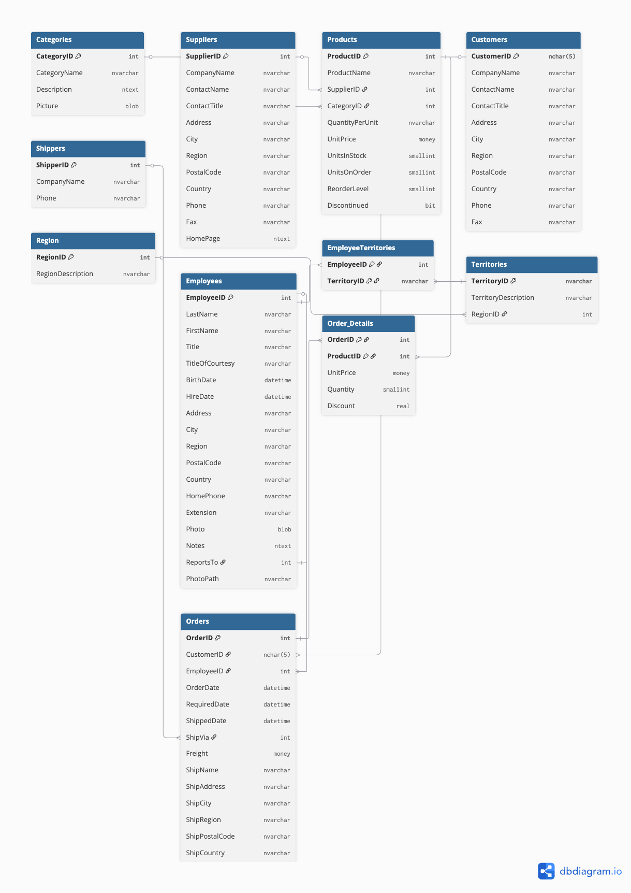

# DSI310_2025 – Data Warehouse Project

## Diagrams

### 1. Chinook (Original ER/Class Diagram)


### 2. Northwind (Original ER/Class Diagram)


### 3. Unified Kimball-style Star Schema


---

## Business Questions (1–3)

### 1). What is the monthly income for each business unit?  
> รายได้รายเดือนของแต่ละ Business Unit คือเท่าไร (รวมค่าส่งแบบ allocate ถ้ามี)

```sql
SELECT
  d.Year,
  d.Month,
  bu.BusinessUnitName,
  SUM(fs.ExtendedAmount + COALESCE(fs.FreightAllocated,0)) AS MonthlyIncome
FROM FactSales fs
JOIN DimDate d           ON fs.DateId = d.DateId
JOIN DimBusinessUnit bu  ON fs.BusinessUnitId = bu.BusinessUnitId
GROUP BY d.Year, d.Month, bu.BusinessUnitName
ORDER BY d.Year, d.Month, bu.BusinessUnitName;
```
#### Results


### 2). Estimate monthly expense for each business unit?
> ประมาณ “ค่าใช้จ่าย” รายเดือนของแต่ละ BU — ใช้ FreightAllocated เป็น proxy (หากใช้ Northwind)
ถ้าใช้เฉพาะ Chinook จะเป็นศูนย์เพราะไม่มีค่าส่งในชุดข้อมูล

```sql
SELECT
  d.Year, d.Month, bu.BusinessUnitName,
  SUM(COALESCE(fs.FreightAllocated,0)) AS MonthlyFreightExpense
FROM FactSales fs
JOIN DimDate d          ON fs.DateId = d.DateId
JOIN DimBusinessUnit bu ON fs.BusinessUnitId = bu.BusinessUnitId
GROUP BY d.Year, d.Month, bu.BusinessUnitName
ORDER BY d.Year, d.Month, bu.BusinessUnitName;
```
#### Results


### 3). What is the sale value pattern from Monday to Sunday?
> รูปแบบมูลค่าการขายตามวันในสัปดาห์ (จันทร์–อาทิตย์)
```sql
SELECT
  d.DayOfWeek,    -- 1=Mon ... 7=Sun
  d.DayName,
  SUM(fs.ExtendedAmount) AS Sales
FROM FactSales fs
JOIN DimDate d ON fs.DateId = d.DateId
GROUP BY d.DayOfWeek, d.DayName
ORDER BY d.DayOfWeek;
```
#### Results


---
# Reflection: Star Schema vs 3NF (Chinook + Northwind)

## 1. ความแตกต่างระหว่าง Star Schema กับแบบฐานข้อมูลเดิม (3NF)

-   **แบบเดิม (3NF):**
    -   มีตารางจำนวนมาก เชื่อมกันด้วย foreign key หลายชั้น เช่น Chinook
        (Track → Album → Artist → Genre), Northwind (Products →
        Categories, Suppliers)
    -   มี bridge table เช่น PlaylistTrack, EmployeeTerritories
    -   ซับซ้อนต่อการ join และเขียน query
-   **Star Schema:**
    -   รวมข้อมูลเชิงอธิบาย (descriptive attributes) ไว้ในตารางมิติ
        (Dimension)
    -   เก็บข้อมูลเชิงตัวเลขธุรกิจ (measures เช่น Revenue, Quantity,
        Discount) ไว้ที่ fact table เดียว (FactSales) ในระดับ line item
    -   ความสัมพันธ์เป็น one-to-many ระหว่างมิติและ fact → query
        ง่ายและชัดเจนกว่า

## 2. ข้อดีของ Star Schema สำหรับงานวิเคราะห์
1. **Query เร็วและง่ายกว่า** –- join น้อยลง โครงสร้างออกแบบมาเพื่อ aggregation/reporting
2. **Business-friendly** –- แยก Fact (ตัวเลข) ออกจาก Dimension (บริบท) ทำให้ตั้งคำถาม/อ่านผลลัพธ์ตรงกับภาษาธุรกิจ
3.	**Conformance (มาตรฐาน)** –- สามารถรวมข้อมูลจากหลายระบบโดยยังเทียบกันได้ (เทียบ BU ระหว่าง Digital Music vs Physical Goods)
4.	**ขยายต่อได้ง่าย** –- เพิ่ม fact ใหม่ (เช่น Returns/Inventory) ได้โดยไม่กระทบโครงสร้างเดิม
5.	**Data governance ง่ายขึ้น** –- คำอธิบาย/รหัสอยู่ศูนย์กลางในมิติ ทำให้การทำความสะอาด/มาตรฐานชื่อทำได้ที่เดียว

------------------------------------------------------------------------